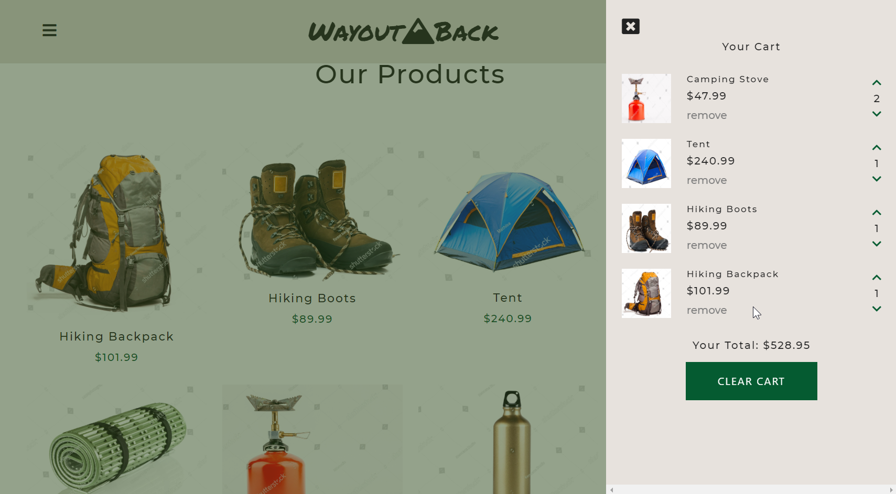

# Simple Shopping Cart Functionality


### URL: https://darnocer.github.io/Shopping-Cart/

## Description

A simple products page with shopping cart functionality built with jQuery.

## Table of Contents

- [Installation](#installation)
- [Usage](#usage)
- [Future Enhancements](#future-enhancements)
- [Credits](#Credits)
- [Questions](#questions)

## Installation

```
fork repo
clone to machine
open with live server
```

## Usage

1. Click "Add to Cart" button on a product to add the product to the cart
2. Increase or decrease number of products and view live total
3. Remove products from cart by clicking "remove" or descreasing the number to 0
4. Expand the cart by clicking the cart icon, and collapse the cart
   

## Future Enhancements

This application is intended to showcase shopping cart functionality only. Other links may not be functional. No further development is planned at this time.

## Credits

- Adapted from Free Code Camp's [E-commerce Shopping Cart tutorial](https://www.youtube.com/watch?v=023Psne_-_4&t=1s)

- shutterstock.com

- unsplash.com

- [Font Awesome](https://fontawesome.com/)

## Questions?

Contact me at [darian.nocera26@gmail.com](mailto:darian.nocera26@gmail.com)

or [](http://www.github.com/darnocer)

Copyright © 2020 [Darian Nocera](http://www.github.com/darnocer)

---

##### _Created with [darnocer's README generator](https://github.com/darnocer/Node.js-and-ES6-README-Generator)_ 👽
